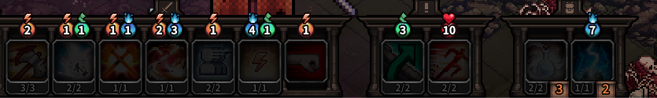
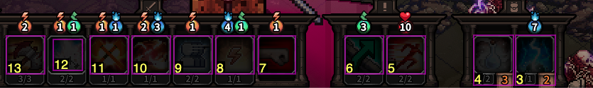
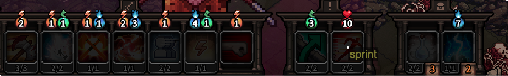
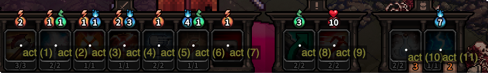

# Flex Mouse Grid

A hands-free mouse grid by Ben Rollin, Tara Roys, timotimo, and aegis, for use with the [Talon voice framework](https://talonvoice.com/). Flex Mouse Grid is just the latest in a series of iterations, and was built on top of [Dense Mouse Grid](https://github.com/tararoys/dense-mouse-grid).

You can think of Flex Mouse Grid as extending the functionality of Dense Mouse Grid, attempting to be an even more flexible, all-in-one voice mouse tool. Some notable differences from Dense Mouse Grid:

- "Points" mapping. Essentially incorporating Andrew Dant's awesome [screen-spots](https://github.com/AndrewDant/screen-spots) tool and adding a light UI. It allows points to be saved on an application-specific basis with a custom name. Example: `point click continue` to click a saved point called "continue".
- "Box" detection. Use image processing techniques to detect boxes on the screen, identifying them and allowing you to click them. You can also save boxes as points. Example: `boxes` to identify all boxes in the active window, and then `box click seven` to click the box labeled "7".

## Installation

1. Install the [Talon voice framework](https://talonvoice.com/docs/index.html#getting-started).
1. Clone the [knausj-talon](https://github.com/knausj85/knausj_talon) repository into your Talon user directory. This tool is designed to be used along with the knausj-talon repository, but is compatible with any repository that provides the letters a-z using the `<user.letters>` capture and numbers using the `<numbers>` capture.
1. Clone this repository into your Talon user directory.
1. Install the python dependencies. Assuming the default install location on a Mac, run these commands:

```
~/.talon/bin/pip install opencv-python-headless
~/.talon/bin/pip install numpy
```

5. Restart Talon.

## Learning to use the tool

If you are just interested in the dense mouse grid features, you may consider just using the simpler [Dense Mouse Grid](https://github.com/tararoys/dense-mouse-grid). Otherwise, you can read the following sections on [Points](#points), [Boxes](#boxes), and finally [Dense Mouse Grid](#dense-mouse-grid-details) to learn about the core features of this tool.

## Points

Flex mouse grid allows saving "points" which are just labeled points on the screen. They are always saved relative to the active window, so you can safely move a window around, and know that points will be unaffected.

### Mapping/unmapping points

- `map <word>` creates a new point at the current location of the mouse cursor with the label "word"
- `unmap <word>` deletes the point labeled "word"
- `unmap everything` deletes all points for the active window

### Showing/hiding point labels

- `points` shows all points for the current window
- `points close` hides all points
- `grid close` hides all points, all boxes, and the dense grid

### Moving to/clicking points

- `point <word>` moves to the point labeled "word"
- `point click <word>` clicks the point labeled "word"
- `point righty <word>` right clicks the point labeled "word"

### Point lists

This is a list of points all with the same label. You can move to/click the third point in a point list simply with

- `point <word> three`

Note that the list is 1-indexed. If you omit the index, it is assumed to be one. Other clicking commands also work in a similar way to the above.

### Mapping points via flex grid coordinates

TODO

## Boxes

For inaccessible programs such as some games where there are visually distinguishable boxes which you would like a quick way to click, there is the boxes feature of flex mouse grid. It attempts to identify boxes with computer vision/image processing, and labels the boxes that it found, allowing you to interact with them.

Lets take as an example this set of boxes from a game:



### Finding boxes

- `boxes` finds boxes using the current window's box detection configuration, labeling each with a number



### Moving to/click boxes

- `box <number>` moves the cursor to the specified box, hiding the boxes afterwards
- `box click <number>` clicks the specified box, hiding the boxes afterwards
- `box righty <number>` right clicks the specified box, hiding the boxes afterwards

### Hiding boxes

- `boxes close` hides all boxes
- `grid close` hides all boxes, all points, and the dense grid

### Mapping boxes as points

Make sure to learn about [Points](#points) first.

- `map <word> box <number>` creates a new point at the center of the chosen box labeled "word"
- `map <word> box <number1> mark <number2>...` creates a point list of two points. You can include more points by including more `mark <number>`s.
- `map <word> box <number1> past <number2>` creates a point list that will include a list for every box in the range between "box number1" and "box number2". Can also be done in reverse.

So if we said `boxes` and saw:


We could say `map sprint box five` to create a point there:



Then we can simply move to the "sprint" button with the phrase `point sprint`

Further, maybe we just want to refer to all of these boxes as actions. We could say a command like: `map act box thirteen past three` which would create a point list as seen below:



It may be a little hard to tell what's going on, but each box got put in a point list with label "act". We could then move our cursor to the same "sprint" button with the following: `point act nine`.

### Finding more boxes

There are some box detection parameter defaults built in that attempt to find boxes, but depending on the colors of a given window, they are not guaranteed to work. In order to find more boxes, you can use voice commands to change these parameters and see the resulting set of boxes that are found.

There are three relevant parameters that are currently changeable:

- `upper` box size upper bound
- `lower` box size lower bound
- `threshold` the filtering threshold. The higher the number, the darker that colors can be distinguished.

You can modify these parameters on an application specific basis with the following commands:

- `boxes <parameter> more`
- `boxes <parameter> less`

So e.g. `boxes upper more` would increase the maximum size that a box can be. After changing any parameter, boxes will be found again so you can gauge if it was a good change or not in real time.

## Dense Mouse Grid details

The Dense Mouse Grid is a completely hands-free replacement for traditional mousing. It replaces mouse movements with voice commands. You tell the computer what grid coordinate you want to move to on the screen, and the mouse grid moves your cursor to that location.

This is the "dense mouse grid". It fills the screen with fields that can be reached with a number and two letters.


### Opening and closing the grid

- `flex grid` to show the grid. It is displayed over the active window by default
- `flex grid screen` to put the grid over the whole screen
- `flex grid screen <number>` to put the grid over a different screen
- `grid close` to close the grid

### Basic usage in frame mode

The grid will appear in Frame Mode by default. Say:

- `cap bat`

This will move the cursor to row "c" and column "b". You can include a number to move the cursor to another block (`3 drum wax`). To click, use whatever voice command you have associated with clicking. By default in knausj_talon, this is `touch`.

### Changing your mind

If you have selected the wrong number, you can choose a different number anytime. If you have selected the wrong row, you can say `row <letter>`, and it will move the highlighed row to that letter. So saying

- `one`
- `harp`
- `row bat`
- `cap`

will result in moving the cursor to coordinate 1 B C.

### More modes

If frame mode does not suit you, there are two other modes that can be used to show the coordinates.

- `grid checker` turns on checker mode, which overlays the coordiantes in a checker pattern. This can be visually confusing, but it splits the difference between being able to immediately see the coordinate and being able to see the contents of your screen.
- `grid full` shows every possible coordinate.
- `grid phonetic` switch to phonetic mode, which is just like frame mode except with full phonetic words labeling the rows and columns instead of individual letters.
- `grid frame` switches to frame mode (the default).

### Grid size

- `grid bigger`
- `grid smaller`

You can adjust the size by a smaller amount by including `bump`, e.g. `grid bigger bump`.

The default size of the grid can be set in `flex_mouse_settings.talon` by changing the number in `user.flex_mouse_grid_field_size = "30"`.

### Grid visibility

The grid can be made more or less transparent with the following commands.

- `background lighter`
- `background darker`
- `letters lighter`
- `letters darker`

You can also include the word `bump` to adjust the value by a smaller amount. For instance, `background darker bump`.

### Grid color

Every color in the grid is modifiable in flex_mouse_settings.talon, allowing you to set the defaults to whatever is comfortable.

The colors use 6 digit hexadecimal RGB colors.
The transparency uses 2-digit hexadecimal numbers for an alpha channel.
